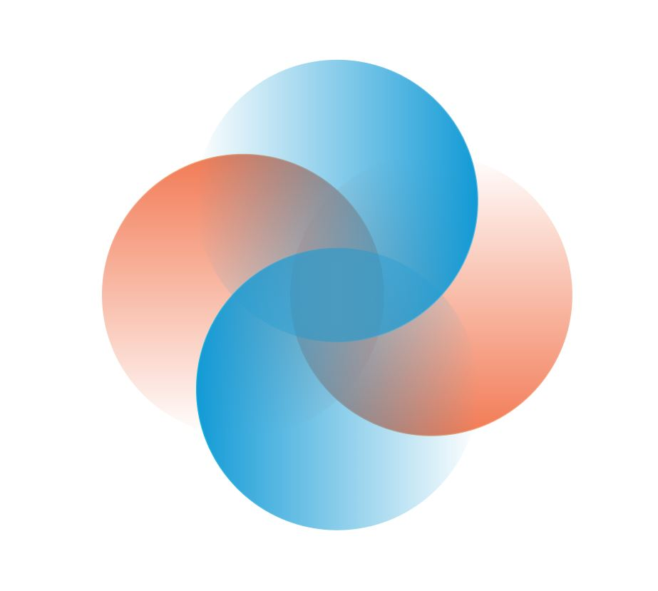

# MIT 2020 Fintech Challenge: SpoofBusters
SpoofBusters is a trading monitoring platform that prevents the manipulations of stock prices through an illegal practice known as "Spoofing".

## Models
| Algorithm        | Observation    |
| ------------- |:-------------:| 
|BD             | Biodiesel (B20 and above)|
|CNG            | Compressed Natural Gas| 
|E85            | Ethanol |
|ELEC           | Electric|
|HY             | Hydrogen| 
|LNG            | Liquefied Natural Gas| 
|LPG            | Liquefied Petroleum Gas (Propane)|

## Prototyping & Visualization pipeline
***

